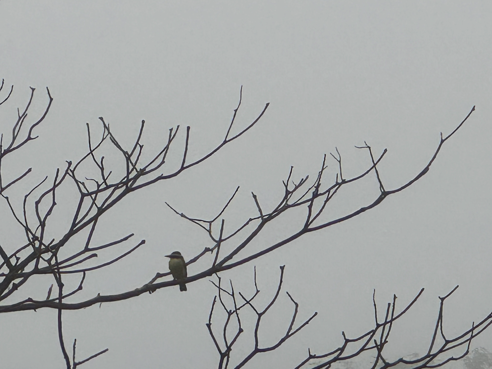

::: {.lead .text-center}
*Un poco de todo, antrópico \~ entrópico.*
:::

{width="100%" fig-align="center"} *Pitangus sulphuratus vivo parado en estructura de Solanum riparium comido por Funga*

::: {.fondopost .lead .text-center}
Estructura de post
:::

::: {.comodin-2col}
::: {}
Título. Categorías. Descripción breve del contenido. Imagen típicamente repetida en contenido.
:::
::: {}
Texto explicativo. Fecha de producción, fecha de modificación, categorías, firma humana, semi-automatizadas, formato e idioma de origen.
:::
:::

