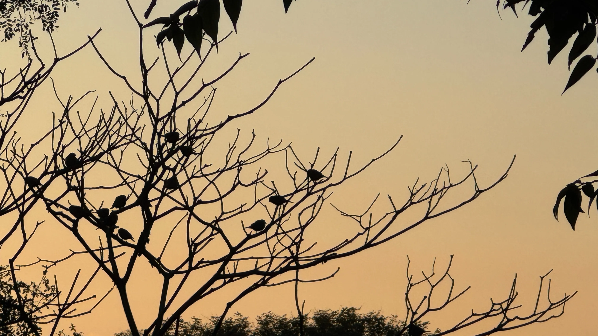
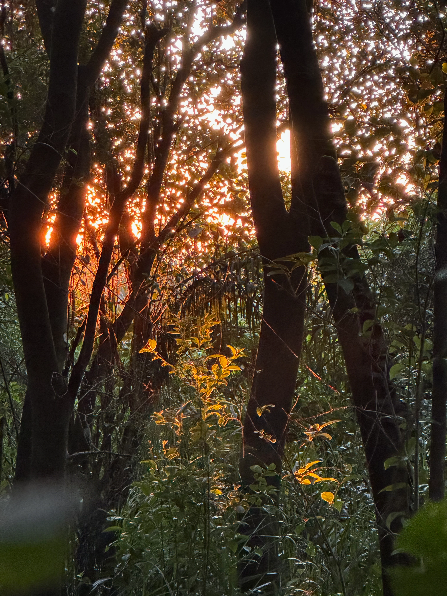

 --- 

{width="100%" fig-align="center"} *pájaros al alba*

 ---  
 
::: {.lead .text-center .fondoportal}

Explorando mundos interactivos.

Investigación en ecología, evolución de relaciones bióticas y ambientales.

Exploración, aprendizaje y experiencias.

:::

 ---  

{width="100%" fig-align="center"} *otoño al amanecer - selva pedemontana - Sierra de San Javier*

 --- 

::: {.fondoportal .text-center}

Trabajo en investigación y educación como empleado de la [Fundación Miguel Lillo](https://www.lillo.org.ar/)\
y del [CONICET](https://www.conicet.gov.ar/) en el [Instituto de Ecología Regional](https://ier.conicet.gov.ar/). 

:::

 ---  

::: {.lead .text-center}

Tucumán, Argentina

:::

 --- 
