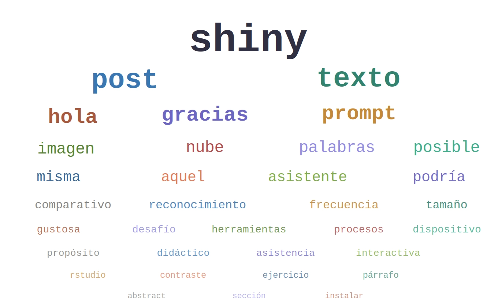
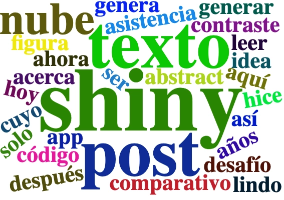

___

Hace relativamente poco tiempo, en este siglo, la formación de imágenes desde programas como R o Python eran de difícil solución.  

En unos pocos años, dispositivos como los asistentes de IA lo pueden resolver sin necesidad de haber aprendido alguna otra interfase.  

Un ejemplo de nube de palabras basada en el diálogo de un prompt (1 consulta + 1 respuesta) a la asistencia de Claude Sonet 4.6 (Anthropic 2026).

### Prompt

Consulta: "Hola! la web está quedando gustosa, muchas gracias! Puedes leer en la sección Acerca de sobre el reconocimiento de tu asistencia. Tengo un desafío, cuyo propósito es comparativo-didáctico, teniendo un post de 2021 y otro post de 2026, con la misma idea y distintas herramientas o procesos. Como entrenando con shiny con RStudio, en aquel tiempo hice este ejercicio: https://mvdqnf-mariano0ordano.shinyapps.io/sawordcloud/ que sigue estable. Eso fue hecho en mayo de 2021. Supongo que ahora, unos 5 años después, la misma imagen generada por aquel pequeño dispositivo, podría transformarse en un solo prompt y un asistente de IA como usted podría generar la figura. ¿Es posible?"

Respuesta de asistencia de IA: "¡Hola! Qué lindo reconocimiento, gracias. Y sí, es completamente posible. Tu app Shiny de 2021 toma un texto y genera una nube de palabras donde el tamaño refleja la frecuencia. Eso hoy se puede hacer directamente aquí. Probemos: pasame un texto y te genero la nube de palabras como imagen SVG interactiva, sin código, sin Shiny, sin instalar nada. Puede ser cualquier texto: un párrafo tuyo, un abstract de un paper, lo que quieras. Así tenés el contraste perfecto para el post comparativo: 2021 con Shiny + R, 2026 con un prompt a un asistente de IA."

___

{width=100%}

Nube de palabras generada a partir de un prompt a Claude Sonnet 4.6 (Anthropic, 2026)

___

{width=100%}

Nube de palabras generada a partir de la [app shiny de 2021](https://mvdqnf-mariano0ordano.shinyapps.io/sawordcloud/). 

___

___

