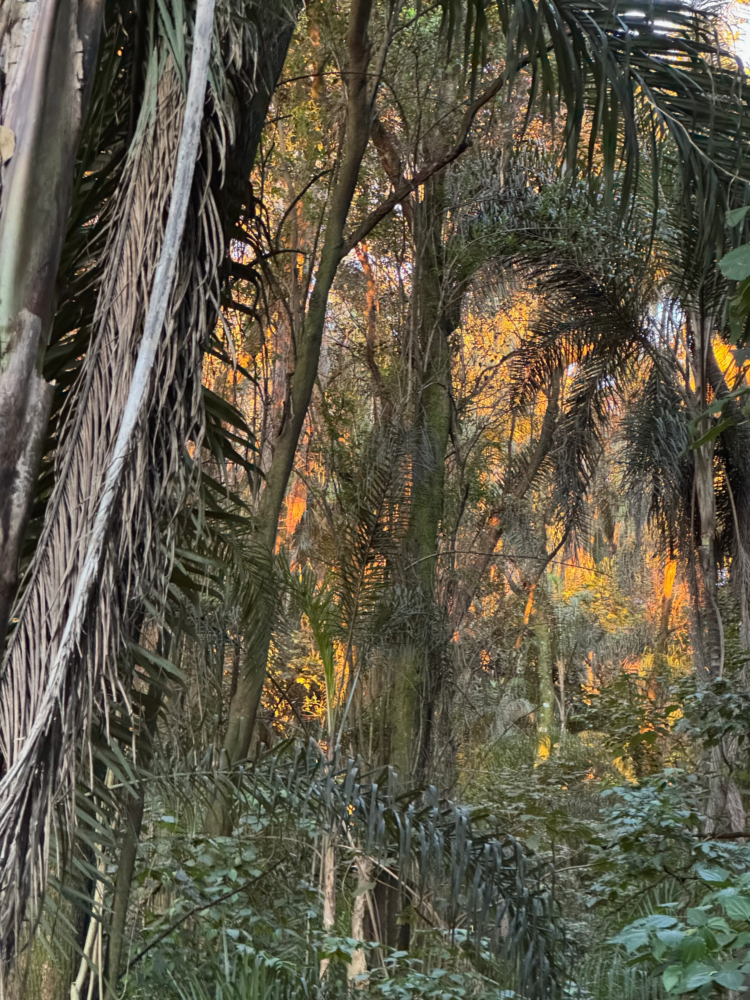

Fotos tomadas desde un mismo punto, a distinta escala, pueden nutrir la interpretación ambiental. 

La percepción y la interpretación ¿en qué medida están afectadas por el dispositivo?  

 ___ 

Un ejemplo de 4 fotos en el pedemonte.

 ___ 

{width=100%}

 ___ 

{width=100%}

 ___ 

{width=100%}

 ___ 

{width=100%}

 ___ 

