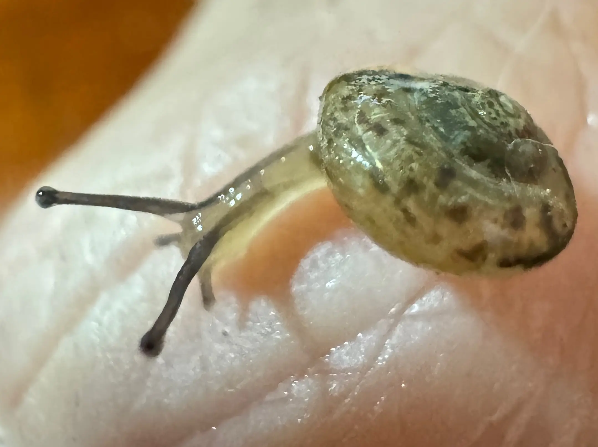

## Caracterización de una investigación

#### Elementos en lista

-   mínimo una persona humana o grupo de personas humanas que generan una investigación (estos conjuntos pueden depender de las reglas de autoría, firma, reconocimientos, derechos y obligaciones de la generación de productos de base de conocimiento)
-   mínimo un conjunto de tipos de dispositivos y máquinas
-   una idea acerca de cómo funciona un sistema, un elemento del entorno natural o artificial con el que interactúan las personas humanas
-   un sistema o marco conceptual, base de conocimiento para referencia sobre que elementos se consideran como conocimiento adquirido
-   un "ambiente" o "entorno" de la investigación
-   unas reglas de juego en un determinado rubro o sector del conocimiento para producir conocimiento adquirido, métodos
-   un proceso en tiempo y espacio, en un \[nivel de organización biológica\]
-   un conjunto de tipos y formas de interacción entre los elementos, incluyendo meta-niveles
-   un tiempo y espacio de entrenamiento y aprendizaje
-   un tiempo y espacio de dedicación a facetas complementarias, comunidad de visiones del conocimiento y actividades *nada que ver*

##### \[Meta-objetivo\] 

Caracterizar el sistema de interacciones bióticas en el \[ámbito doméstico\]

```{mermaid}
graph LR
    %% Estilos formales para distinguir constructos de indicadores
    classDef latente fill:#f1f8e9,stroke:#558b2f,stroke-width:2px;
    classDef observado fill:#ffffff,stroke:#37474f,stroke-width:1px;
    classDef resultado fill:#e0f7fa,stroke:#00838f,stroke-width:2px;

    %% 1. CONSTRUCTOS LATENTES (Ecosistema de Creación)
    IMP((Importación de recursos))
    EXP((Exportación de recursos))
    SEL((Filtro selectivo antropocénico))
    %% Correlación / Covarianza entre constructos del ecosistema
    SEL --> EXP

    %% 2. INDICADORES OBSERVADOS (Variables medibles que definen el constructo)
    R1[Alimentos] --- IMP
    R2[Residuos de Alimentos] --- EXP
    
    S1[Percepción humana de seres no humanos] --- SEL
    S2[Dispositivo de interacción] --- SEL
    
    B1[Perfil de Biodiversidad ] --- SEL
    D1[Características del ámbito doméstico] --- SEL
  
    %% 3. VARIABLES DE PROCESO Y RESULTADO (Impacto del Ecosistema)
    
    DEM[Secuencia de dispositivo de mediación]    
    PHE[Variación Fenotípica de la Vida Silvestre]

    %% 4. RELACIONES ESTRUCTURALES (Hipótesis de causalidad)
    IMP --> DEM
    DEM --> EXP & SEL
    EXP --> SEL
    SEL --> PHE
    

    %% Aplicación de clases visuales
    class SEL,IMP,EXP latente;
    class DEM,R1,R2,S1,S2,B1,D1 observado;
    class PHE resultado;
```

---

{width="100%"}

---
