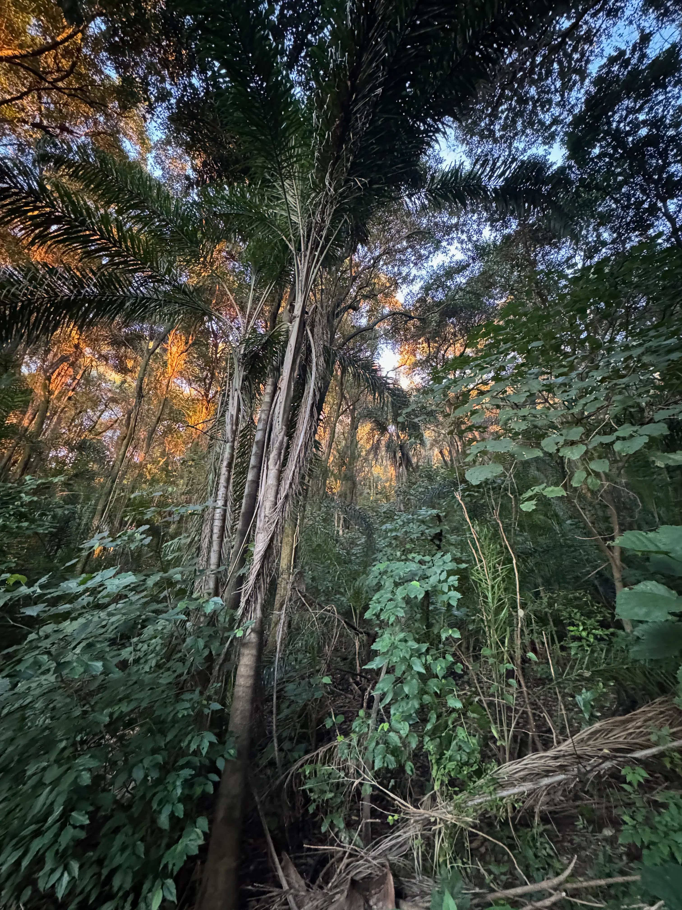
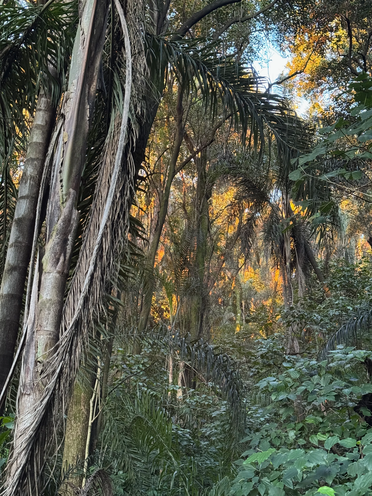

Fotos tomadas a distinta escala pueden nutrir la interpretación ambiental de un sitio. La percepción y la interpretación ¿en qué medida están afectadas por el dispositivo?  

Un ejemplo de 4 fotos en el pedemonte.

___

{width=50%}

Lente 0.5 x ~ 13 mm

___

{width=50%}

Lente 1 x ~ 24 mm

___

___

{width=50%}

Lente 2 x ~ 48 mm

___

{width=50%}

Lente 3 x ~ 77 mm

___