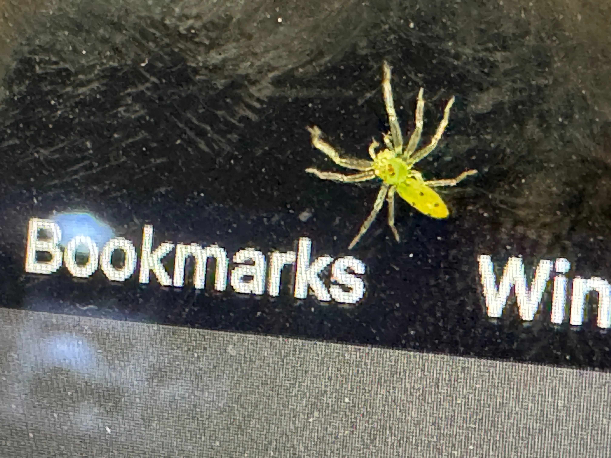

{width="100%"}
*Lyssomanes pauper, una arañita saltarina silvestre, recorriendo un dispositivo del ámbito doméstico*

### Título
Variación fenotípica de la vida silvestre en el ámbito doméstico: una revisión sistemática

#### Dispositivos de investigación
Preguntas que guían la idea
¿Por qué hago lo que hago y hacia dónde se supone que va?

Fuente de elección del tema o sistema

Dispositivos de interacción

Marco conceptual
Ecología y evolución de interacciones bióticas

Métodos de Investigación
Plan de gestión de datos compartidos

Revisión sistemática generalizada

Glosario ad hoc

Ecosistema digital
Cloud drives, Google WorkSpace, OSF, STAPLE, RStudio, GitHub

Entrenamiento de desarrollo
COS

Status
En preparación

