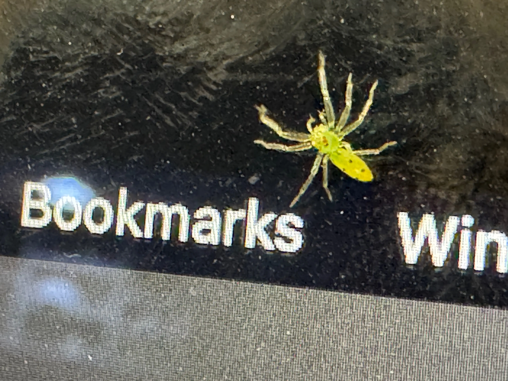

{width="100%"}
*Lyssomanes pauper, una arañita saltarina silvestre, recorriendo un dispositivo del ámbito doméstico*

### Título
Variación fenotípica de la vida silvestre en el ámbito doméstico: una revisión sistemática

#### Dispositivos de investigación
- Preguntas que guían la idea
¿Por qué hago lo que hago y hacia dónde se supone que va?

- Fuente de elección del tema o sistema

- Dispositivos de interacción
  En desarrollo

- Marco conceptual
  Ecología y evolución de interacciones bióticas

- Métodos de Investigación
  Métodos a los métodos
- Revisión sistemática generalizada
  
- Plan de gestión de datos compartidos
  Principios FAIR/CARE

- Glosario ad hoc

- Ecosistema digital
  Cloud drives, Google WorkSpace, OSF, FORRT, STAPLE, RStudio, GitHub, _Interdomestic_

- Entrenamiento de desarrollo
  [Center for Open Science](https://cos.io)

- Status
En preparación

- Componentes de proyecto activos
  [Interdomestic](https://maordano.github.io/interdomestic/)

